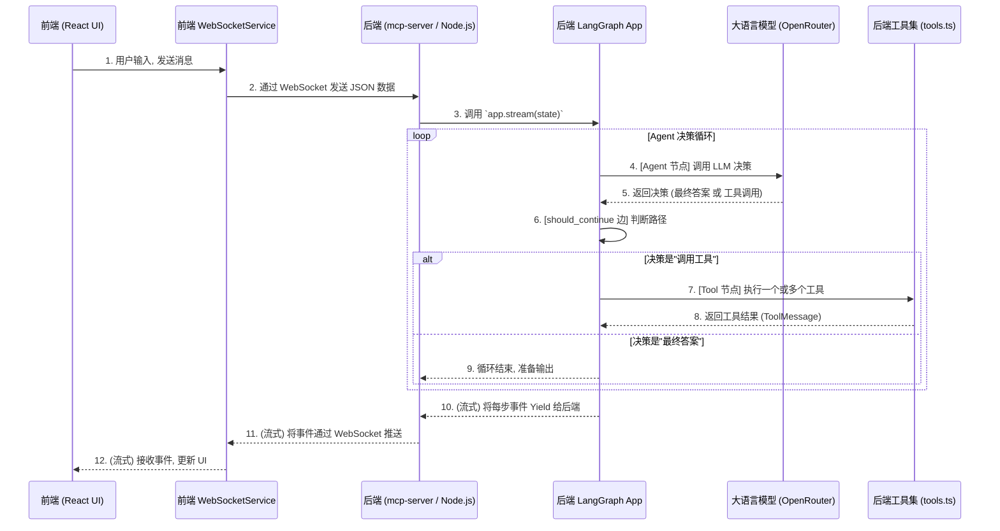

# 项目端到端数据流详解 (基于 LangGraph 架构)

本文档旨在详细阐述当用户在前端界面提交一个请求后，数据在整个系统中的完整生命周期，涵盖从前端交互、WebSocket 通信、后端 LangGraph 处理，到最终结果流式返回并渲染的全过程。

---

## 概览

系统采用前后端分离架构，通过 WebSocket 进行实时、双向的流式通信。前端负责用户交互与状态展示，后端（`mcp-server`）则集成了由 LangGraph.js 驱动的 AI Agent 核心逻辑。

点击查看 Mermaid 流程图源码

---

### 第 1 步：[前端] 用户输入与状态更新

1.  **用户交互**: 用户在 [`ChatInterface.tsx`](./packages/frontend/src/components/ChatInterface.tsx) 组件的输入框中键入问题，然后通过调用 [`handleSend` 函数 (L30)](./packages/frontend/src/components/ChatInterface.tsx#L30) 来发送。
2.  **状态管理**: `handleSend` 函数内部调用了 Zustand store (`useAppStore`) 的 [`addUserMessage` action (L33)](./packages/frontend/src/components/ChatInterface.tsx#L33) 来将新消息添加到全局状态。
3.  **触发发送**: 紧接着，`handleSend` 函数直接调用 WebSocket 服务实例的发送方法 [`webSocketService.sendMessage(input)`](./packages/frontend/src/components/ChatInterface.tsx#L35)。

### 第 2 步：[前端 -> 后端] WebSocket 通信

1.  **服务调用**: 调用 [`WebSocketService.ts` 中的 `sendMessage` 方法 (L89)](./packages/frontend/src/services/WebSocketService.ts#L89)。
2.  **数据序列化**: 此方法内部进一步调用了 [`send` 方法 (L77)](./packages/frontend/src/services/WebSocketService.ts#L77)，将包含聊天消息、ID 和时间戳的完整对象序列化为 JSON 字符串。
3.  **发送数据**: 该 JSON 字符串通过 `ws.send()` 被发送到后端的 `mcp-server`。

### 第 3 步：[后端] 服务器接收与 LangGraph 启动

1.  **监听消息**: 在 [`mcp-server/src/index.ts` 中，WebSocket 服务器 (`wss`) 的 `on('connection')` 回调内 (L226)](./packages/mcp-server/src/index.ts#L226)，为每个客户端连接设置了 [`ws.on('message')` 事件监听器 (L229)](./packages/mcp-server/src/index.ts#L229)。
2.  **解析请求**: 服务器解析收到的 JSON 字符串，并调用 [`handleUserRequest` 函数 (L232)](./packages/mcp-server/src/index.ts#L232)。
3.  **调用图应用**: 在 `handleUserRequest` 内部，构造一个初始的 `GraphState` 后，调用 LangGraph 应用实例的 [`app.stream(initialState)` 方法 (L59)](./packages/mcp-server/src/index.ts#L59)。这是整个 Agent 思考过程的入口。

### 第 4 步：[后端] LangGraph Agent 节点决策

1.  **进入图**: `app.stream()` 的调用使得 `GraphState` 进入了在 [`agent.ts` 中定义的图的入口节点——`agent` (L96)](./packages/mcp-server/src/agent.ts#L96)。该节点映射到 [`call_model` 函数 (L39)](./packages/mcp-server/src/agent.ts#L39)。
2.  **调用 LLM**: `call_model` 函数将当前状态中的所有 `messages` 传递给配置好的大语言模型 [`boundModel.invoke(messages)`](./packages/mcp-server/src/agent.ts#L41)。
3.  **获取决策**: LLM 返回一个 `AIMessage`，可能包含最终答案或 `tool_calls`。
4.  **状态更新**: LLM 返回的 `AIMessage` 被 `StateGraph` 自动追加到 `messages` 列表中。

### 第 5 步：[后端] LangGraph 条件边路由

1.  **路径判断**: 流程离开 `agent` 节点后，进入通过 [`workflow.addConditionalEdges`](./packages/mcp-server/src/agent.ts#L98) 定义的条件路由。
2.  **检查工具调用**: 该路由使用 [`should_continue` 函数 (L30)](./packages/mcp-server/src/agent.ts#L30) 来检查最后一条消息。
    *   如果包含 `tool_calls`，函数返回 `"continue"`，图流向 `action` 节点。
    *   如果不包含，返回 `"end"`，图执行结束。

### 第 6 步：[后端] LangGraph Tool 节点执行

1.  **节点激活**: 如果决定调用工具，流程会进入 `action` 节点，该节点映射到 [`call_tool_node` 函数 (L45)](./packages/mcp-server/src/agent.ts#L45)。
2.  **调用工具**: `call_tool_node` 提取工具名称和参数，并调用 [`mcpTools.call_tool`](./packages/mcp-server/src/agent.ts#L61)。
3.  **工具分发**: 在 [`MCPMasterTools.call_tool` 方法 (L157)](./packages/mcp-server/src/tools.ts#L157) 中：
    *   如果是 `query_context7`，则在后端直接执行。
    *   对于其他工具（如 `execute_spreadjs`），它通过 WebSocket 将工具调用请求发送到前端执行。
4.  **封装消息**: 工具执行后，其结果被封装成 [`ToolMessage`](./packages/mcp-server/src/agent.ts#L65)，并添加到 `GraphState` 中。

### 第 7 步：[后端] 循环与迭代

1.  **返回 Agent**: `action` 节点执行完毕后，根据[`workflow.addEdge("action", "agent")` (L103)](./packages/mcp-server/src/agent.ts#L103) 的定义，流程自动流回 `agent` 节点。
2.  **再次决策**: `agent` 节点再次被激活，但这一次，它传递给 LLM 的是包含了工具执行结果的、更丰富的对话历史。
3.  这个 **`Agent -> Edge -> Action -> Agent`** 的循环会持续进行，直到 `should_continue` 边决定结束流程。

### 第 8 步：[后端 -> 前端] 流式响应

1.  **实时 Yield**: `app.stream()` 是一个异步生成器。在 `index.ts` 中，使用 [`for await...of` 循环 (L62)](./packages/mcp-server/src/index.ts#L62) 来消费这个流。
2.  **实时转发**: 在图的**每一步执行**（如 `agent` 节点完成、`action` 节点完成）后，`app.stream` 都会 `yield` 一个事件对象。循环体立即捕获这个事件，并将其通过 [`ws.send()`](./packages/mcp-server/src/index.ts#L68) 实时转发给前端。
3.  **实现真流式**: 这种机制保证了前端能够实时看到 Agent 的"思考过程"，而不是等待最终结果。

### 第 9 步：[前端] 实时渲染

1.  **接收事件**: 前端的 [`WebSocketService`](./packages/frontend/src/services/WebSocketService.ts) 在 [`this.ws.onmessage` 回调 (L176)](./packages/frontend/src/services/WebSocketService.ts#L176) 中接收到从后端流式推送过来的事件。
2.  **更新状态**: `handleMessage` 方法被调用，它会遍历所有注册的处理器，最终将事件分发到 `useAppStore`，实时更新前端状态。
3.  **UI 响应式更新**: 诸如 [`ChatInterface.tsx`](./packages/frontend/src/components/ChatInterface.tsx) 的 React 组件订阅了 `useAppStore` 的状态。当状态变化时，它们会自动重新渲染，从而向用户展示 Agent 的思考步骤、工具调用情况和最终结果。

这个端到端的流式架构，以 LangGraph 为核心，实现了高度动态、可观察和可扩展的 AI Agent 交互体验。